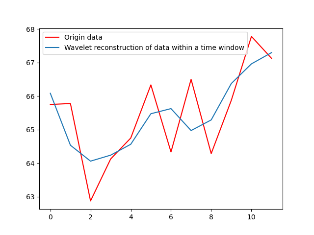
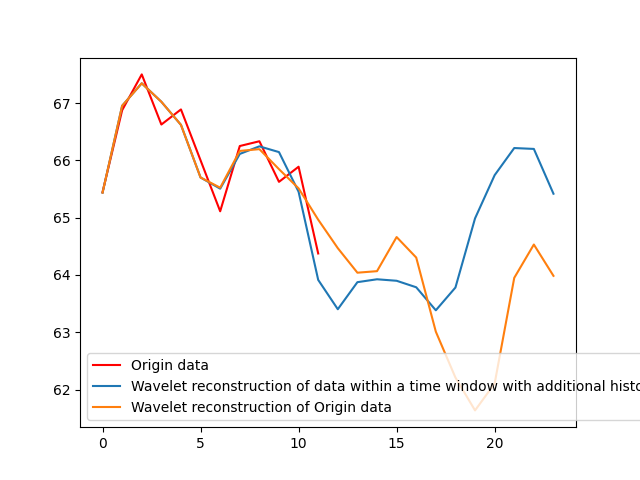

# ModWaveMLP: MLP-Based Mode Decomposition and Wavelet Denoising Model to Defeat Complex Structures in Traffic Forecasting

Code for our paper: "[ ModWaveMLP: MLP-based Mode Decomposition and Wavelet Denoising Model to Defeat Complex Structures in Traffic Forecasting]".
#### Results Update
Because of the deviation of the experimental results by referring to the work of previous researchers, the results are updated as follows:

| Dataset  | 3steps@MAE, @MAPE, @RMSE | 6steps@MAE, @MAPE, @RMSE | 12steps@MAE, @MAPE, @RMSE |
| -------- | ------------------------ | ------------------------ | ------------------------- |
| METR-LA  | 2.68, 7.06%, 5.27        | 2.99, 8.41%, 6.22        | 3.38, 9.82%, 7.13         |
| PEMS-BAY | 1.30, 2.82%, 2.79        | 1.59, 3.68%, 3.72        | 1.89, 4.47%, 4.38         |
Specially, we also improve the model structure without relying on the wavelet transform, and the improved results are as follows:

| Dataset  | 3steps@MAE, @MAPE, @RMSE | 6steps@MAE, @MAPE, @RMSE | 12steps@MAE, @MAPE, @RMSE |
| -------- | ------------------------ | ------------------------ | ------------------------- |
| METR-LA  | 2.70, 7.11%, 5.30        | 3.03, 8.44%, 6.24        | 3.40, 9.88%, 7.24         |
| PEMS-BAY | 1.32, 2.86%, 2.83        | 1.63, 3.74%, 3.77        | 1.91, 4.54%, 4.44         |

We are still trying out some new ideas and the experimental results will be kept up to date, so if you have any questions or suggestions, please feel free to contact us via this email (kenianqingzheng@qq.com) and we look forward to talking with you!
### Further reflections

Wavelet Decomposition Reconstruction with Sequences

- Wavelet Decomposition Denoising in 12 Time Steps

  

  Considering only the information within the time window (12 time steps, limited denoising ability)

- Add 12 time steps after the current moment a week ago to form a new sequence for decomposition denoising

  Considering the obvious periodicity of traffic information, consider denoising the information from a week ago combined with the information in the current time window

  

  The historical information is the information of the last 12 time steps of the time window one week ago, and it can be seen that compared with the original data, the trend is similar.

- Add 12 time steps after the current moment one day ago to form a new sequence of decomposition denoising

  Because of the difference between weekdays and holidays, it is not reasonable to simply splice the previous day's information into the current time window.

- Add 12 time steps before and after the current moment a week ago to form a new sequence for denoising.

- Add 12 time steps before and after the current moment of the day before to form a new sequence for denoising.

- Add 12 time steps before and after the current moment one hour ago to form a new sequence for denoising.

### Future work you can do about ModWaveMLP

- Adding spatial information data.
- Optimizing the network structure and combining it with gnn-based, transformer-based and other advanced structures.
- Preliminary experiments have shown that wavelet decomposition combined with information from one week ago is effective, is there a better way to combine historical information for wavelet decomposition denoising?(future work)


## 1. Table of Contents

```text
data            ->  metr-la and pems-bay raw data and processed data
Datasets        ->  dataset preprocessing code
Model           ->  model implementation 
```

## 2. Requirements

```bash
pip install -r requirements.txt
```

## 3. Data Preparation

Alterbatively, the datasets can be found as follows:

- METR-LA and PEMS-BAY: These datasets were released by DCRNN[1]. Data can be found in its [GitHub repository](https://github.com/liyaguang/DCRNN).
Please put these two files metr-la.h5 and pems-bay.h5 in the data folder

## 4. Training the ModWaveMLP Model

The hyperparameters of ModWaveMLP can be changed in the Parameters.py

```bash
python run_MoDWaveMLP.py --dataset metr-la --horizon 12 --history_length 12
python run_MoDWaveMLP.py --dataset pems-bay --horizon 12 --history_length 12
```
